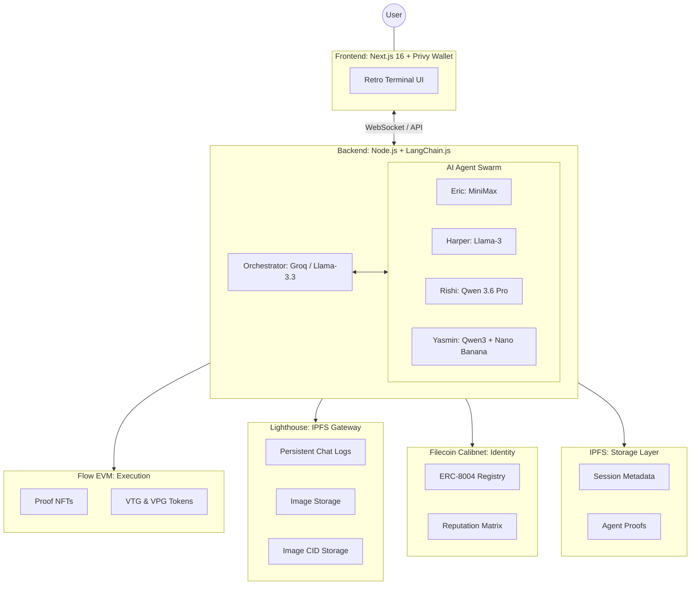

<p align="center">
  
</p>

<p align="center">
  <strong>Decentralized Autonomous Agency powered by AI Agents on Flow EVM & Filecoin</strong>
</p>

---

## Overview

Vantage Labs is a Decentralized Autonomous Agency (DAA) — a multi-agent AI system where four specialized agents collaborate to help users navigate the Web3 ecosystem. Built on **Flow EVM** for proof-of-execution and **Filecoin** for identity and permanent storage, every agent action is verifiable on-chain.

### Key Features

- **AI Agent Swarm**: Four specialized agents (Eric, Harper, Rishi, Yasmin) coordinated by an Orchestrator
- **Dual-Chain Architecture**: Flow EVM for proof NFTs, Filecoin for agent identity and reputation
- **Human-in-the-Loop**: All on-chain actions require user approval before execution
- **Verifiable Actions**: Every session log is uploaded to Filecoin via Lighthouse and linked to an NFT
- **Terminal Interface**: Retro-style terminal UI for interacting with the agent swarm
- **Multi-LLM Backend**: Groq, Gemini, and OpenRouter power different agents for specialized performance

## Architecture



## Meet the Agents

### Eric - Market Analyst
- **Specialty**: Market research, price analysis, yield opportunities, on-chain analytics
- **Inference Provider**: OpenRouter
- **Model used**: MiniMax M2.5 (`openrouter-minimax`)
- **Tools**: `analyze_market`, `store_analysis`, `get_yield_opportunities`, `query_balance`

### Harper - Trader
- **Specialty**: Trade execution, portfolio management, DeFi interactions
- **Inference Provider**: Groq
- **Model used**: Llama 3 (`groq`)
- **Tools**: `verify_agent_identity`, `prepare_transaction`, `execute_swap`

### Rishi - Developer
- **Specialty**: Smart contract generation, code debugging, contract deployment
- **Inference Provider**: OpenRouter
- **Model used**: Nemotron / Qwen 3.6 Plus (`openrouter-nemotron`)
- **Tools**: `generate_contract`, `deploy_contract`, `store_proof`

### Yasmin - Creative
- **Specialty**: NFT art generation, content creation, marketing
- **Inference Provider**: Google DeepMind (Native)
- **Model used**: Gemini Flash & ImageGen (`gemini`)
- **Tools**: `generate_image`, `create_nft_metadata`, `upload_to_filecoin`, `create_tweet`

### Orchestrator
- **Role**: Parses user intent, creates execution plans, routes tasks to agents
- **Inference Provider**: Groq
- **Model used**: Llama-3.3-70B Versatile (`llama-3.3-70b-versatile`)

## Agent Identity & Reputation

Every agent has a verifiable on-chain identity and reputation score, stored across two Filecoin Calibnet contracts.

### On-Chain Identity

Each agent is registered with a unique **ERC-8004 identity** in the `IdentityRegistry` contract on Filecoin Calibnet, giving them a verifiable on-chain identity. The identity's `tokenURI` points to an IPFS-hosted metadata JSON (via Lighthouse) containing the agent's name, role, and model.

| Agent | Token ID | Role | On-Chain ID |
|-------|----------|------|-------------|
| Eric | 1 | market_analyst | Filecoin Calibnet |
| Harper | 2 | trader | Filecoin Calibnet |
| Rishi | 3 | developer | Filecoin Calibnet |
| Yasmin | 4 | creative | Filecoin Calibnet |


The `VantageAgentRegistry` contract maps agent names to their token IDs and stores additional metadata (model used, agent URI), making it easy to look up agents by name on-chain.

### Reputation System

Agent reputation is tracked in the `ReputationRegistry` contract. Scores start at **5000** and change based on outcomes:

| Event | Score Change |
|-------|-------------|
| Successful action | +100 |
| Failed action | -50 |
| Endorsement from another agent | +200 |

Reputation scores are publicly readable on-chain and can be queried via the `GET /api/agents/:name/status` endpoint.

### Proof of Execution

After every session completes:
1. The full session log is uploaded to Filecoin via **Lighthouse** → returns a CID
2. An **ERC-721 proof NFT** is minted on Flow EVM Testnet with `tokenURI` pointing to the session log CID
3. The `txHash`, `tokenId`, and a block explorer link are returned to the user

This creates an immutable, publicly verifiable record of every agent action.

## Project Structure

```
vantage-labs/
├── contracts/                  # Solidity smart contracts (Hardhat)
│   ├── src/                    # Contract source files
│   ├── test/                   # Contract tests
│   ├── scripts/                # Deployment scripts
│   └── deployments/            # Deployment records
├── backend/                    # Node.js backend
│   └── src/
│       ├── agents/             # LangChain agent implementations
│       ├── services/           # Blockchain & storage services
│       ├── routes/             # Express REST routes
│       ├── websocket/          # Socket.io handlers
│       ├── tools/              # LangChain tools per agent
│       └── config/             # Environment & chain configuration
├── frontend/                   # Next.js 16 frontend
    └── src/
        ├── app/                # Next.js App Router pages
        ├── components/         # React components
        ├── contexts/           # React context providers
        ├── hooks/              # Custom hooks (WebSocket, etc.)
        └── lib/                # API client, socket manager

```

## Quick Start

<details>
<summary><b>🛠 Prerequisites & Installation</b></summary>

- Node.js 20+
- npm or yarn

```bash
# Clone the repository
git clone https://github.com/charlesms1246/vantage-labs.git
cd vantage-labs

# Install dependencies
cd contracts && npm install
cd ../backend && npm install
cd ../frontend && npm install

# Set up environment variables
cp backend/.env.example backend/.env
# Edit backend/.env with your API keys

# For frontend, create .env.local
cp frontend/.env.local.example frontend/.env.local 2>/dev/null || \
  echo "NEXT_PUBLIC_PRIVY_APP_ID=your_app_id
NEXT_PUBLIC_SOCKET_URL=http://localhost:3001
NEXT_PUBLIC_API_URL=http://localhost:3001" > frontend/.env.local
```
</details>

<details>
<summary><b>Running Locally</b></summary>

```bash
# Terminal 1: Start backend
cd backend
npm run dev

# Terminal 2: Start frontend
cd frontend
npm run dev
```

Visit `http://localhost:3000` to use the application.
Visit `http://localhost:3001/logs` to view backend logs.
</details>

## Environment Variables

<details>
<summary><b>Backend env configuration</b></summary>

### Backend (`backend/.env`)
| Variable | Description |
| :------- | :---------- |
| `PORT` | Server port (default 3001) |
| `GROQ_API_KEY` | API Key for Groq (Llama 3/3.3) |
| `GEMINI_API_KEY` | API Key for Google Gemini (Flash & ImageGen) |
| `OPENROUTER_API_KEY` | API Key for OpenRouter (MiniMax, Nemotron) |
| `FILECOIN_RPC` | RPC endpoint for Filecoin Calibnet |
| `FLOW_RPC` | RPC endpoint for Flow EVM Testnet |
| `DEPLOYER_PRIVATE_KEY` | Private key for the DAA's on-chain wallet |
| `LIGHTHOUSE_API_KEY` | API Key for Lighthouse storage |

</details>

<details>
<summary><b>Frontend env configuration</b></summary>

### Frontend (`frontend/.env.local`)
| Variable | Description |
| :------- | :---------- |
| `NEXT_PUBLIC_PRIVY_APP_ID` | Privy ID for wallet auth |
| `NEXT_PUBLIC_SOCKET_URL` | WebSocket backend URL |
| `NEXT_PUBLIC_API_URL` | REST API backend URL |

</details>

## Code References & Tech Stack Implementations

<details>
<summary><b> Agent & Service On-Chain Interactions</b></summary>

| Agent / Service | Action | Implementation Reference | Interaction Layer |
| :--- | :--- | :--- | :--- |
| **Eric** (Market Analyst) | Balance Queries | [market-analysis.ts:L20-23](backend/src/tools/market-analysis.ts#L20-L23) | Flow EVM (Ethers) |
| | Supply Analysis | [market-analysis.ts:L81-82](backend/src/tools/market-analysis.ts#L81-L82) | Flow EVM (Ethers) |
| | Research Storage | [market-analysis.ts:L132](backend/src/tools/market-analysis.ts#L132) | Lighthouse (IPFS) |
| **Harper** (Trader) | Token Minting | [trading.ts:L91](backend/src/tools/trading.ts#L91) | Flow EVM (Ethers) |
| | Generic Transfers | [trading.ts:L124-166](backend/src/tools/trading.ts#L124-L166) | Flow EVM (Ethers) |
| | Identity Check | [trading.ts:L18](backend/src/tools/trading.ts#L18) | Filecoin (ERC-8004) |
| **Rishi** (Developer) | Contract Deploy | [contracts.ts:L231-253](backend/src/tools/contracts.ts#L231-L253) | Flow EVM (Ethers) |
| | Proof Storage | [contracts.ts:L269](backend/src/tools/contracts.ts#L269) | Lighthouse (IPFS) |
| **Yasmin** (Creative) | Image Upload | [creative.ts:L49](backend/src/tools/creative.ts#L49) | Lighthouse (IPFS) |
| | Metadata Upload | [creative.ts:L256](backend/src/tools/creative.ts#L256) | Lighthouse (IPFS) |
| **System** (Handler) | Session Archiving | [handler.ts:L139](backend/src/websocket/handler.ts#L139) | Lighthouse (IPFS) |
| | Proof Anchor | [handler.ts:L154](backend/src/websocket/handler.ts#L154) | Flow EVM (Session NFT) |

</details>

<details>
<summary><b>Filecoin & Lighthouse Core Logic</b></summary>

| File | Role | Reference |
| :--- | :--- | :--- |
| **Identity Service** | ERC-8004 Interaction | [filecoin.ts:L9-73](backend/src/services/filecoin.ts#L9-L73) |
| **Lighthouse Service** | IPFS/Filecoin Gateway | [lighthouse.ts:L16-184](backend/src/services/lighthouse.ts#L16-L184) |
| **Storage Tool** | Generic IPFS Persistence | [storage.ts:L5-16](backend/src/tools/storage.ts#L5-L16) |
| **Identity Contract** | Agent Registry Logic | [IdentityRegistry.sol](contracts/contracts/identity/IdentityRegistry.sol) |
| **Reputation Contract** | On-Chain Trust Logic | [ReputationRegistry.sol](contracts/contracts/reputation/ReputationRegistry.sol) |
| **Vantage Registry** | Agent Search Table | [VantageAgentRegistry.sol](contracts/contracts/VantageAgentRegistry.sol) |

</details>

<details>
<summary><b>Flow EVM Core Logic</b></summary>

| File | Role | Reference |
| :--- | :--- | :--- |
| **Flow Service** | Core Execution Wrapper | [flow.ts:L8-137](backend/src/services/flow.ts#L8-L137) |
| **Chain Config** | RPC & Wallet Providers | [chains.ts:L5-45](backend/src/config/chains.ts#L5-L45) |
| **VTG Token** | ERC-20 Implementation | [SampleToken.sol](contracts/contracts/templates/SampleToken.sol) |
| **Proofs NFT** | Session Log Anchoring | [SampleNFT.sol](contracts/contracts/templates/SampleNFT.sol) |
| **Tipping logic** | Direct ETH tipping pipeline | [TippingContract.sol](contracts/contracts/templates/TippingContract.sol) |

</details>

## Deployed Contracts

### Filecoin Calibnet (Chain ID: 314159)

| Contract | Address | Description |
|----------|---------|-------------|
| [IdentityRegistry (ERC-8004)](contracts/contracts/identity/IdentityRegistry.sol) | `0xb3Df63Ac5Ec5648d2E764a7C579148F29858E99D` | Verifiable on-chain identity management representing each AI agent |
| [ReputationRegistry (ERC-8004)](contracts/contracts/reputation/ReputationRegistry.sol) | `0x558298297E714312D5670dBe4dbc15E1D240a811` | Dynamic trust and performance scoring matrix for cross-agent workflows |
| [VantageAgentRegistry](contracts/contracts/VantageAgentRegistry.sol) | `0x7Bbfb48BCEDF4B562fAB3cFdcb5974bf7cACd290` | Core routing table explicitly linking token IDs to agent names and endpoints |
| [On-Chain CID Registry](contracts/contracts/templates/SampleNFT.sol) | `0x27E1CCbb95f02Ed210031D86220A918dCffD0A37` | Immutable historical log storage anchoring IPFS hashes to blockchain state |

### Flow EVM Testnet (Chain ID: 545)

| Contract | Address | Description |
|----------|---------|-------------|
| [SampleToken (VTG)](contracts/contracts/templates/SampleToken.sol) | `0xb3Df63Ac5Ec5648d2E764a7C579148F29858E99D` | An ERC-20 reference utility token implementation |
| [SampleNFT](contracts/contracts/templates/SampleNFT.sol) | `0x558298297E714312D5670dBe4dbc15E1D240a811` | Primary ERC-721 token representing AI generated visuals |
| [TippingContract](contracts/contracts/templates/TippingContract.sol) | `0x96A4978752D0fC8FccDe3c168A6a9E1c20B62330` | Gasless pipeline contract to facilitate ETH tips seamlessly |
| [ERC1155MultiToken](contracts/contracts/templates/ERC1155MultiToken.sol) | `0x8e0E65541EaDE9B8D5d69519A67923CE89263a06` | ERC-1155 multi-asset token contract allowing unified management of fungible and non-fungible tokens |
| [NFTMarketplace](contracts/contracts/templates/NFTMarketplace.sol) | `0xAa61FAD0c0270905264395c29817343C8d0998f3` | Decentralized marketplace facilitating the trading and listing of NFTs |
| [SimpleDAO](contracts/contracts/templates/SimpleDAO.sol) | `0xFBD6428dE890599A15FebC2D8F2bda945f693bBD` | Governance contract enabling decentralized voting and community-driven proposal execution |
| [StakingRewards](contracts/contracts/templates/StakingRewards.sol) | `0xa75A41ab96f2387fD2360E5FBa85A0f0EF2F431a` | Automated yield distribution contract for staking and rewarding liquidity providers |

## Future Implementations
- **Multi-Chain Connectivity:** Integrate generic multi-chain messaging protocols directly via Flow infrastructure for interoperability.
- **Trusted Execution Environments (TEEs):** Off-load critical LLM inference and identity/key governance steps natively to confidential computing layers on hardware.
- **Decentralized Persistent Memory:** Switch memory nodes and Vector-DB history logs to a heavily resilient web3 substrate linked natively back to the agent index parameters.

## Developer Notes
- **State Gating:** WebSockets (`handler.ts`) drive the primary state loop—the system halts recursive user chat inputs proactively preventing duplicate/hallucinative plan regeneration overriding execution environments.
- **Orchestrator Parsing Logic:** Ensure agents exclusively process specific atomic tooling configurations (tools logic operates natively by fetching dynamically typed subsets within `trading.ts` & `market-analysis.ts`). Orcehstrator operates strictly stateless recursively iterating contextual arrays back and forth to keep system prompt windows clean.

<div align="center">

<h3>Built By

[Immanuel](https://github.com/xavio2495) x [Charles](https://github.com/charlesms1246)

</div>
